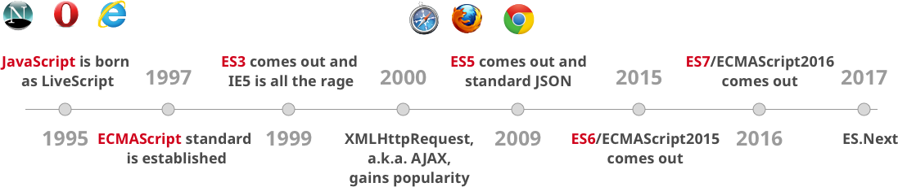

@title[Rails loving Javascript]
# Rails <span style="color: #e49436">loving</span> Javascript

#### Eine Reise hin und wieder zurück
<br>
<br>
<span style="color: #bbb; font-size: 80%">[Rails, Ruby, jQuery, ES6, NPM, Yarn, Webpack]</span>

+++

## Über mich
#### Mitgründer und Entwickler bei @sovido
<br>
<span style="font-size: 0.8em;">
  <span style="color:white">htt</span><span style="color:white">ps://twitter.com/</span><span style="color: #e49436">dirksiemers</span>
  <br>
  <span style="color:white">htt</span><span style="color:white">ps://github.com/</span><span style="color: #e49436">dirksiemers</span>
  <br>
  <span style="color:white">htt</span><span style="color:white">ps://getpocket.com/</span><span style="color: #e49436">@dirksiemers</span>
</span>

---
@title[Rails]
### Es war einmal...
<br>
<ul>
  <li class="fragment"><span style="font-size: 80%">Rails Version 1.0 wurde im Dezember 2005 released</span></li>
  <li class="fragment"><span style="font-size: 80%">2007 Version 2.0 mit REST als Plattform für Web Services</span></li>
  <li class="fragment">
    <span style="font-size: 80%">Rails 5.1 im April 2017 mit Webpacker und System tests</span>
    <br>
    <span style="font-size: 80%">aber </span><span style="font-size: 80%; color: #e49436">ohne</span><span style="font-size: 80%"> jQuery als default dependency</span>
  </li>
  <li class="fragment"><span style="font-size: 80%">Aktuell: Rails 5.1.4 vom 7. September 2017</span></li>
</ul>

Note: 
Representational State Transfer (GET POST PUT DELETE in der HTTP Schicht, zustandslos)

---

## Rails fühlt sich einfach richtig an.

---

### MVC (<span style="color: #e49436">Model View Controller</span>)
<br>
<ul>
  <li class="fragment"><span style="color: #e49436">M</span><span style="font-size: 80%">   ActiveRecord, die ORM-Schicht</span></li>
  <li class="fragment"><span style="color: #e49436">C</span><span style="font-size: 80%">   ActionController, die Steuerungsschicht (auch REST)</span></li>
  <li class="fragment"><span style="color: #e49436">V</span><span style="font-size: 80%">   ActionView, die Präsentationsschicht</span></li>
</ul>

Note:
Datenbanken wie z.B. SQLite, DB2, Informix, MySQL, Oracle, PostgreSQL und Microsoft SQL Server
HTML, XML – z. B. für XHTML und Web Services, JavaScript – RJS-Templates, Binärdaten
Templatesysteme: ERB für (X)HTML und Javascript, Builder für XML, Haml, Sass, CoffeeScript
HTTP-Header manipulieren

---

# Philosophie
<br>
### <span style="color: #e49436">Don’t repeat yourself.</span>
### <span style="color: #e49436">Convention over Configuration.</span>

---
@title[Ruby]

### Rails nutzt <span style="color: #e49436">Ruby</span>
- Entworfen von Yukihiro Matsumoto
- Ziel: Flexibilität, Ausdrucksstärke und Einfachheit |
- Synthese aus Perl, Smalltalk, Eiffel, Ada und Lisp |
- sollte objektorientierter als Python und zugleich mächtiger als Perl sein |

Note:
Wenn du Java, JavaScript, PHP, Perl, oder Python kennst, wird Ruby für dich leicht zu erlernen sein

---
@title[Rails Sample Code]

### <span style="color: #e49436">Lesbarkeit</span>
<br>

```ruby
class Project < ApplicationRecord 
  belongs_to :portfolio

  has_one :project_manager
  has_many :milestones
  has_many :deliverables, through: milestones

  validates :name, :description, presence: true 
  validates :non_disclosure_agreement, acceptance: true 
  validates :short_name, uniqueness: true
end
```

---
@title[Rails Live Code]

### <span style="color: #e49436">Live Code</span>
<br>

```shell
$ rails _5.1.4_ new serom-demo
$ cd serom-demo
$ ls -p
$ bin/rails about
$ code .
```

+++

```shell
$ bin/rails generate scaffold Product \
            title:string description:text \
            image_url:string price:decimal
$ bin/rails db:migrate   
$ bin/rails server
```

<a style="font-size:0.6em;" href="https://localhost:3000/products" target="_blank">[ Browser öffnen ]</a>

Note:
Migration
JSON

---
@title[JavaScript History]

### JavaScript History
<br>
- Skriptsprache
- ursprünglich LiveScript |
- nur wenige Gemeinsamkeiten mit Java |
- dynamische Manipulation von Webseiten |
- Nutzung z.B in MongoDB und Microcontrollern |

+++


<figcaption><span style="font-size: 0.5em;">http://adrianmejia.com/blog/2016/10/19/Overview-of-JavaScript-ES6-features-a-k-a-ECMAScript-6-and-ES2015/</span></figcaption>

Note:
European Computer Manufacturers Association (ECMA)
Asyn-chronous JavaScript and XML

---
@title[Loving JavaScript]

### Loving JavaScript
<br>
- mit ES6 (Juni 2015) Klassen und Module
- Paketmanager NPM
- Dependency-Management mit Yarn
- Bündelung aller Assets mit Webpacker
- Rails unterstützt aktuell React, Angular und Vue

Note:
Yarn: Bundler for JavaScript (Yehuda Katz (Ember.js))

---
@title[Rails React Live Code]

### <span style="color: #e49436">Adding React & Dependencies</span>
<br>

Webpacker als gem hinzufügen 
```ruby
gem 'webpacker', '~> 3.0'
```

```shell
$ bin/rails webpacker:install
$ bin/rails webpacker:install:react
```

+++

### <span style="color: #e49436">Insert React</span>
<br>

```ruby
<%= javascript_pack_tag("hello_react") %>
```

```shell
$ bin/webpack-dev-server
```

+++

### <span style="color: #e49436">JS Testing</span>
<br>

```ruby
# In test/system/products_test.rb
assert_selector "h2", text: "Hello Dirk!"
```

```shell
$ bin/rails test:system
```

+++

### <span style="color: #e49436">Use Yarn</span>
<br>

```shell
$ yarn add bootstrap
```

```ruby
# In app/assets/stylesheets/application.css:
*= require bootstrap/dist/css/bootstrap

# In app/assets/javascripts/application.js:
//= require bootstrap/dist/js/bootstrap

# In app/views/layouts/application.html.erb
<div class="container">
  <%= yield %>
</div>

# In app/views/products/index.html.erb
<table class="table">
```